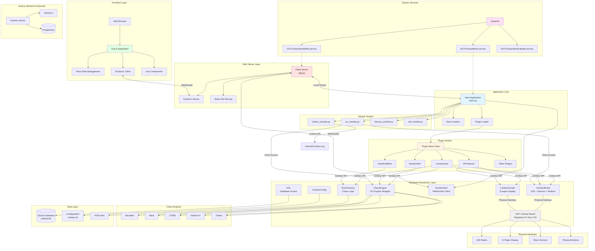
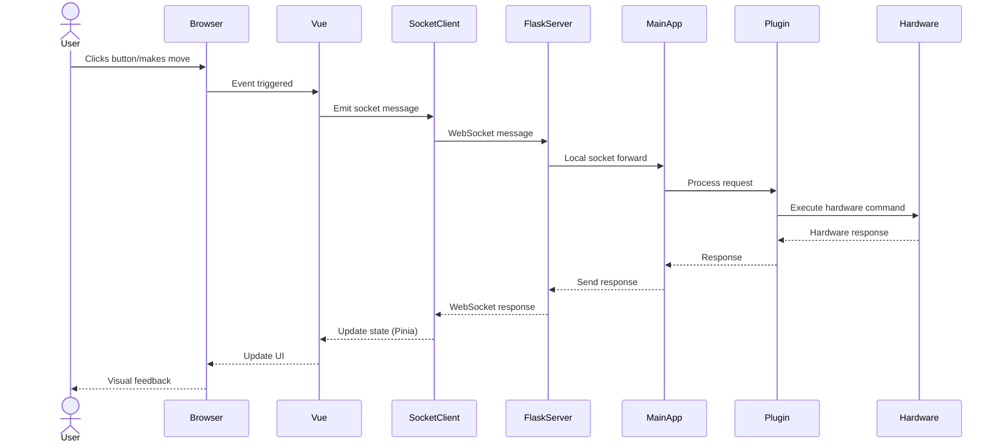
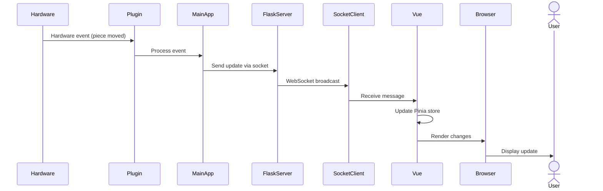
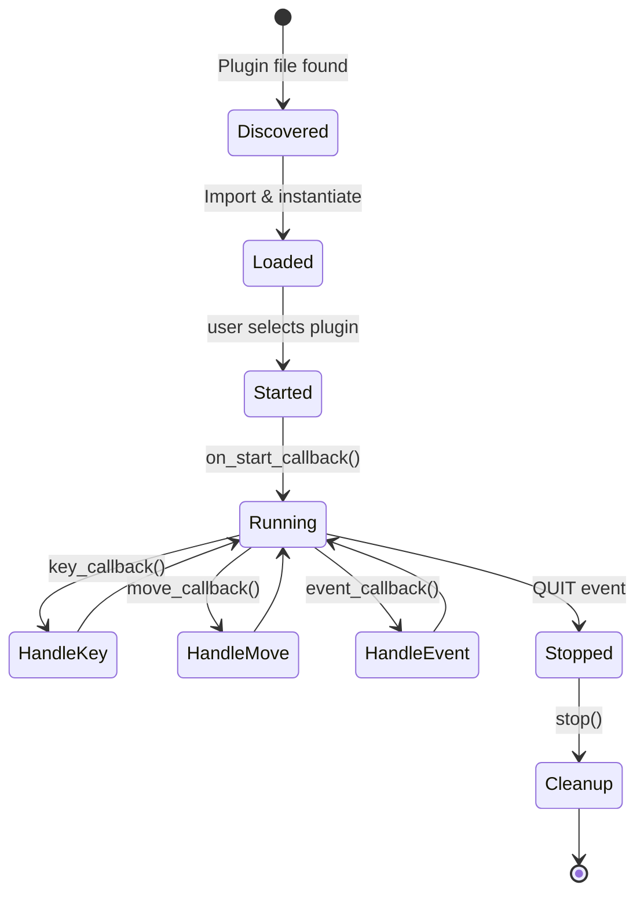

# Arquitectura del Proyecto DGT Centaur Mods

## Resumen del Proyecto

DGT Centaur Mods es un sistema de modificación integral para el tablero de ajedrez electrónico DGT Centaur. Reemplaza el firmware estándar con un sistema mejorado que añade conectividad WiFi, interfaz web, arquitectura de plugins e integración con múltiples motores de ajedrez. El software se ejecuta en una Raspberry Pi Zero 2 W dentro del tablero y se distribuye como un paquete Debian.

## Stack Tecnológico

### Backend (Python)
- **Python 3.x**: Lenguaje principal del backend
- **python-chess**: Lógica de ajedrez y protocolo UCI
- **Pillow (PIL)**: Procesamiento de imágenes para pantalla e-paper
- **Flask**: Framework web para API REST
- **flask-socketio**: Comunicación WebSocket en tiempo real
- **berserk**: Cliente API de Lichess.org
- **wpa-pyfi**: Configuración de WiFi
- **SQLite**: Base de datos embebida

### Backend Alternativo (Node.js)
- **Node.js >=16**: Runtime JavaScript
- **Express ^4.18.2**: Framework web
- **Socket.io ^4.7.2**: WebSockets bidireccionales
- **pg ^8.11.3**: Cliente PostgreSQL

### Frontend (Vue.js)
- **Vue 3.3.8**: Framework progresivo de JavaScript
- **TypeScript 5.2.2**: Superset tipado de JavaScript
- **Vite 5.0.0**: Build tool y dev server

#### UI/UX
- **Tailwind CSS 3.3.5**: Framework CSS utility-first
- **DaisyUI 4.1.0**: Componentes UI para Tailwind
- **@tailwindcss/typography 0.5.10**: Plugin de tipografía

#### Chess & Gaming
- **@chrisoakman/chessboardjs 1.0.0**: Renderizado visual del tablero
- **chess.js 1.0.0-beta.6**: Lógica de ajedrez en cliente
- **jQuery 3.7.1**: Requerido por chessboardjs

#### State Management & Communication
- **Pinia 2.1.7**: State management oficial para Vue 3
- **socket.io-client 4.7.2**: Cliente WebSocket

#### Code Editor
- **CodeMirror 6.0.1**: Editor de código
- **vue-codemirror 6.1.1**: Wrapper Vue para CodeMirror
- **@codemirror/lang-python 6.1.3**: Soporte de sintaxis Python
- **@codemirror/language 6.9.2**: Sistema de lenguajes
- **@codemirror/legacy-modes 6.3.3**: Modos adicionales

#### UI Components & Icons
- **@heroicons/vue 2.0.18**: Iconos SVG

#### Development Tools
- **@vitejs/plugin-vue 4.5.0**: Plugin oficial Vue para Vite
- **vue-tsc 1.8.22**: Verificador de tipos TypeScript para Vue
- **Prettier 3.1.0**: Formateador de código
- **Autoprefixer 10.4.16**: PostCSS plugin
- **PostCSS 8.4.31**: Procesador CSS

### Motores de Ajedrez (UCI)
- **Stockfish**: Motor de ajedrez de código abierto más fuerte
- **Maia**: Motor basado en IA que juega como humanos
- **CT800**: Motor de ajedrez compacto
- **Rodent IV**: Motor con personalidad ajustable
- **Galjoen**: Motor de ajedrez holandés
- **Texel**: Motor de ajedrez sueco
- **Wyld Chess**: Motor ligero

### Infraestructura
- **Systemd**: Gestión de servicios del sistema
- **Debian Package (.deb)**: Sistema de distribución
- **Raspberry Pi OS**: Sistema operativo base

## Arquitectura del Sistema

### Patrón Arquitectónico

El proyecto implementa una **arquitectura de capas con plugin system**, combinando:

1. **Hardware Abstraction Layer (HAL)**: Clases que abstraen el hardware físico
2. **Plugin Architecture**: Sistema extensible de modos de juego
3. **Client-Server Architecture**: Comunicación web en tiempo real
4. **Microservices Pattern**: Servicios separados e independientes

```
┌─────────────────────────────────────────────────────────────┐
│                      Web Interface (Vue.js)                  │
│          Pinia Stores + Socket.io Client + Components       │
└────────────────────┬────────────────────────────────────────┘
                     │ WebSocket (Socket.io)
┌────────────────────┴────────────────────────────────────────┐
│                   Flask Web Server (app.py)                  │
│              Socket.io Server + Static File Serving          │
└────────────────────┬────────────────────────────────────────┘
                     │ Local Socket
┌────────────────────┴────────────────────────────────────────┐
│              Main Application (main.py)                      │
│          Menu System + Plugin Loader + Navigation            │
└─────┬──────────────────────────────────────────────────┬────┘
      │                                                    │
┌─────┴─────────────────┐                    ┌───────────┴─────────┐
│   Plugin System       │                    │   Hardware Layer    │
│                       │                    │                     │
│  ┌─────────────────┐  │                    │  ┌───────────────┐  │
│  │ CentaurDuel     │  │                    │  │ CentaurBoard  │  │
│  │ ElProfessor     │  │                    │  │ CentaurScreen │  │
│  │ RandomBot       │  │◄───────────────────┤  │ ChessEngine   │  │
│  │ HandAndBrain    │  │   Centaur API      │  │ SocketClient  │  │
│  │ TeamPlay        │  │                    │  │ GameFactory   │  │
│  │ ...             │  │                    │  └───────────────┘  │
│  └─────────────────┘  │                    └─────────────────────┘
└───────────────────────┘                              │
                                                       │
                                          ┌────────────┴────────────┐
                                          │   Physical Hardware     │
                                          │                         │
                                          │  ┌──────────────────┐   │
                                          │  │ DGT Centaur     │   │
                                          │  │ - LED Matrix    │   │
                                          │  │ - E-Paper       │   │
                                          │  │ - Piece Sensors │   │
                                          │  │ - Buttons       │   │
                                          │  └──────────────────┘   │
                                          └─────────────────────────┘
```

## Estructura de Directorios y Archivos

```
DGTCentaurMods/
├── DEBIAN/                          # Control de paquete Debian
│   ├── control                      # Metadatos del paquete
│   ├── postinst                     # Script post-instalación
│   ├── postrm                       # Script post-eliminación
│   ├── preinst                      # Script pre-instalación
│   └── prerm                        # Script pre-eliminación
│
├── etc/
│   └── systemd/system/              # Servicios systemd
│       ├── DGTCentaurMods.service          # Servicio aplicación principal
│       ├── DGTCentaurModsWeb.service       # Servicio interfaz web
│       └── DGTCentaurModsUpdate.service    # Servicio auto-actualización
│
├── node.js/                         # Servidor backend Node.js (alternativo)
│   ├── main.js                      # Punto de entrada Node.js
│   ├── package.json                 # Dependencias Node (Express, Socket.io, pg)
│   └── node_modules/                # Módulos npm instalados
│
└── opt/DGTCentaurMods/              # Directorio principal de aplicación
    ├── main.py                      # Punto de entrada Python
    │
    ├── classes/                     # Capa de abstracción de hardware (HAL)
    │   ├── CentaurBoard.py          # Control de hardware del tablero
    │   │                            #   - Control de LEDs
    │   │                            #   - Detección de piezas
    │   │                            #   - Manejo de botones
    │   │                            #   - Lectura de posición FEN
    │   │
    │   ├── CentaurScreen.py         # Gestión de pantalla e-paper
    │   │                            #   - Renderizado de texto
    │   │                            #   - Dibujo de posiciones
    │   │                            #   - Gráficos personalizados
    │   │
    │   ├── ChessEngine.py           # Wrapper de motores UCI
    │   │                            #   - Cálculo de movimientos async
    │   │                            #   - Evaluación de posiciones
    │   │                            #   - Configuración ELO
    │   │                            #   - Soporte multi-motor
    │   │
    │   ├── Plugin.py                # Clase base para plugins
    │   │                            #   - Define interfaz de callbacks
    │   │                            #   - API estática Centaur
    │   │                            #   - Gestión de ciclo de vida
    │   │
    │   ├── GameFactory.py           # Motor principal del juego
    │   │                            #   - Validación de movimientos
    │   │                            #   - Grabación PGN
    │   │                            #   - Funcionalidad undo/redo
    │   │                            #   - Gestión de estado del juego
    │   │
    │   ├── SocketClient.py          # Cliente WebSocket
    │   │                            #   - Comunicación bidireccional
    │   │                            #   - Sincronización de estado
    │   │                            #   - Control remoto
    │   │
    │   ├── CentaurConfig.py         # Gestor de configuración
    │   ├── DAL.py                   # Capa de acceso a datos
    │   ├── Clock.py                 # Reloj de ajedrez
    │   ├── Log.py                   # Sistema de logging
    │   └── LiveScript.py            # Scripts de automatización en vivo
    │
    ├── plugins/                     # Plugins de modos de juego
    │   ├── CentaurDuel.py           # Modo duelo Centaur
    │   ├── ElProfessor.py           # Modo entrenamiento
    │   ├── Squiz.py                 # Modo quiz de ajedrez
    │   ├── HandAndBrain.py          # Modo mano y cerebro
    │   ├── AlthoffBot.py            # Bot Althoff
    │   ├── RandomBot.py             # Bot de movimientos aleatorios
    │   ├── TeamPlay.py              # Modo juego en equipo
    │   └── README.md                # Documentación de desarrollo de plugins
    │
    ├── modules/                     # Módulos de juego standalone
    │   ├── uci_module.py            # Jugar contra motores UCI
    │   ├── lichess_module.py        # Juego online en Lichess
    │   ├── famous_module.py         # Reproducción de partidas famosas
    │   ├── wifi_module.py           # Configuración WiFi
    │   ├── uci_resume.py            # Reanudar partida UCI
    │   └── 1vs1_module.py           # Humano vs humano
    │
    ├── web/                         # Interfaz web
    │   ├── app.py                   # Servidor Flask
    │   │                            #   - Servidor Socket.io
    │   │                            #   - Archivos estáticos
    │   │                            #   - Endpoints API
    │   │
    │   └── client/                  # Frontend Vue.js
    │       ├── package.json         # Dependencias frontend
    │       ├── vite.config.ts       # Configuración Vite
    │       ├── tsconfig.json        # Configuración TypeScript
    │       ├── tailwind.config.js   # Configuración Tailwind
    │       ├── index.html           # Punto de entrada HTML
    │       │
    │       └── src/
    │           ├── main.ts          # Entrada de app Vue
    │           ├── App.vue          # Componente raíz
    │           ├── socket.ts        # Cliente Socket.io
    │           ├── pieces.ts        # Configuración de piezas
    │           │
    │           ├── components/      # Componentes Vue
    │           │   ├── Navbar.vue            # Barra de navegación
    │           │   ├── Chessboard.vue        # Tablero de ajedrez
    │           │   ├── ChessboardArrows.vue  # Flechas en tablero
    │           │   ├── Menu.vue              # Sistema de menús
    │           │   ├── ChatPanel.vue         # Panel de chat
    │           │   ├── Editor.vue            # Editor de código
    │           │   ├── PgnPanel.vue          # Panel PGN
    │           │   ├── ViewPgn.vue           # Visor PGN
    │           │   ├── PreviousGames.vue     # Partidas anteriores
    │           │   ├── BoardPanel.vue        # Panel del tablero
    │           │   ├── CentaurScreen.vue     # Emulador de pantalla
    │           │   ├── WebSettings.vue       # Configuración web
    │           │   ├── LogEvents.vue         # Registro de eventos
    │           │   ├── Toasts.vue            # Notificaciones
    │           │   └── Dialogs.vue           # Diálogos modales
    │           │
    │           └── stores/          # Stores de Pinia
    │               ├── board.ts              # Estado del tablero físico
    │               ├── chessboard.ts         # Estado del tablero virtual
    │               ├── menu.ts               # Estado del menú
    │               ├── chat.ts               # Estado del chat
    │               ├── editor.ts             # Estado del editor
    │               ├── history.ts            # Historial de partidas
    │               ├── display.ts            # Estado de visualización
    │               └── screen.ts             # Estado de la pantalla
    │
    ├── engines/                     # Binarios de motores de ajedrez
    │   ├── stockfish                # Motor Stockfish (47MB)
    │   ├── maia                     # Motor Maia IA (1.3MB)
    │   ├── ct800                    # Motor CT800 (288KB)
    │   ├── rodentIV                 # Motor Rodent IV (219KB)
    │   ├── galjoen                  # Motor Galjoen (460KB)
    │   ├── texel                    # Motor Texel (1MB)
    │   └── wyldChess                # Motor Wyld (170KB)
    │
    ├── resources/                   # Recursos multimedia
    │   ├── images/                  # Imágenes e iconos
    │   ├── fonts/                   # Fuentes para e-paper
    │   └── sounds/                  # Efectos de sonido
    │
    ├── scripts/                     # Scripts de automatización
    ├── famous_pgns/                 # Partidas famosas en formato PGN
    ├── config/                      # Configuración en tiempo de ejecución
    ├── defaults/                    # Configuraciones por defecto
    │   └── config/
    │       └── centaur.ini          # Archivo de configuración principal
    │
    ├── db/                          # Base de datos SQLite
    │   └── centaur.db               # Base de datos principal
    │
    ├── lib/                         # Librerías adicionales
    ├── consts/                      # Constantes y enumeraciones
    │   └── Enums.py                 # Definiciones de enums
    │
    └── test/                        # Tests unitarios
        ├── test_common.py           # Tests comunes
        └── test_chess.py            # Tests de lógica de ajedrez
```

## Diagrama de Arquitectura con Mermaid



## Flujo de Datos

### 1. Interacción Usuario Web → Hardware



### 2. Interacción Hardware → Web



### 3. Plugin Lifecycle



## Componentes Principales

### 1. Hardware Abstraction Layer (HAL)

**CentaurBoard** (`classes/CentaurBoard.py`)
- Control completo del hardware del tablero
- Gestión de matriz LED (64 LEDs individuales)
- Detección de piezas mediante sensores magnéticos
- Manejo de botones físicos (HELP, PLAY, UP, DOWN, BACK, TICK)
- Lectura de posición en formato FEN

**CentaurScreen** (`classes/CentaurScreen.py`)
- Control de pantalla e-paper
- Renderizado de texto con múltiples fuentes
- Dibujo de posiciones de ajedrez
- Gráficos personalizados y layouts
- Sistema de doble buffer para actualizaciones

**ChessEngine** (`classes/ChessEngine.py`)
- Wrapper para motores UCI
- Cálculo asíncrono de movimientos
- Evaluación de posiciones
- Configuración de nivel ELO
- Soporte para múltiples motores simultáneos

### 2. Plugin System

**Plugin Base Class** (`classes/Plugin.py`)

Define la interfaz estándar para todos los plugins:

```python
class Plugin:
    def splash_screen(self):
        """Muestra pantalla inicial del plugin"""

    def on_start_callback(self):
        """Llamado al iniciar el plugin"""

    def key_callback(self, key):
        """Maneja presiones de botones físicos"""

    def event_callback(self, event, outcome):
        """Maneja eventos del juego"""

    def move_callback(self, move):
        """Valida movimientos del jugador"""

    def undo_callback(self):
        """Maneja operaciones de deshacer"""

    def field_callback(self, field):
        """Maneja selección de casillas"""
```

**API Estática Centaur**

Proporciona acceso unificado al hardware:

```python
Centaur.print("Hello")              # Imprimir en pantalla
Centaur.lights_off()                # Apagar LEDs
Centaur.flash("e4")                 # Parpadear casilla
Centaur.play_computer_move("e2e4")  # Ejecutar movimiento
Centaur.sound(Enums.Sound.CORRECT)  # Reproducir sonido
```

### 3. Web Interface

**Flask Server** (`web/app.py`)
- Servidor Socket.io para comunicación en tiempo real
- Serving de archivos estáticos (dist de Vue)
- Bridge entre web y aplicación principal
- Manejo de eventos bidireccional

**Vue.js Application** (`web/client/src/`)

Arquitectura basada en componentes:

- **State Management**: Pinia stores para estado global
- **Real-time Communication**: Socket.io client
- **Chess Visualization**: Chessboardjs + chess.js
- **Code Editing**: CodeMirror para scripts en vivo
- **Responsive Design**: Tailwind CSS + DaisyUI

**Pinia Stores**:
- `board.ts`: Estado del tablero físico
- `chessboard.ts`: Estado del tablero virtual
- `menu.ts`: Sistema de navegación
- `chat.ts`: Mensajes y comunicación
- `editor.ts`: Editor de código
- `history.ts`: Historial de partidas

### 4. System Services

**DGTCentaurMods.service**
- Ejecuta `main.py` como usuario `pi`
- Directorio de trabajo: `/opt/DGTCentaurMods`
- Reinicia automáticamente en caso de fallo
- Depende de DGTCentaurModsWeb.service

**DGTCentaurModsWeb.service**
- Ejecuta servidor Flask `app.py`
- Puerto por defecto: configurable
- Siempre reinicia en caso de error

**DGTCentaurModsUpdate.service**
- Verifica actualizaciones desde GitHub
- Descarga e instala nuevas versiones automáticamente
- Ejecuta en segundo plano

## Comunicación entre Componentes

### WebSocket Protocol

**Canales principales:**

1. **'request'**: Comandos y solicitudes de datos
2. **'web_message'**: Mensajes ligeros, chat, control LED

**Mensajes típicos:**

```javascript
// Solicitar estado del tablero
socket.emit('request', {get_board_state: true})

// Enviar movimiento
socket.emit('request', {move: "e2e4"})

// Control de LEDs
socket.emit('web_message', {light_squares: ["e2", "e4"]})

// Ejecutar script
socket.emit('request', {live_script: "print('Hello')"})
```

### Local Socket Communication

Flask se comunica con `main.py` mediante socket local Unix:

```python
# En main.py
SOCKET.send_web_message({"event": "move", "move": "e2e4"})

# En app.py (Flask)
socketio.emit('board_update', data)
```

## Patrones de Diseño Utilizados

### 1. Singleton Pattern
- Clases de hardware (`CentaurBoard`, `CentaurScreen`)
- Acceso mediante método `.get()`

### 2. Factory Pattern
- `GameFactory`: Crea y gestiona instancias de juegos
- Plugin Loader: Descubre y carga plugins dinámicamente

### 3. Observer Pattern
- Sistema de callbacks en plugins
- WebSocket event emitters/listeners
- Pinia reactive stores

### 4. Strategy Pattern
- Plugins intercambiables con interfaz común
- Múltiples motores de ajedrez con API unificada

### 5. Facade Pattern
- API estática `Centaur` simplifica acceso al hardware
- Abstracción completa del hardware subyacente

## Flujo de Desarrollo

### 1. Desarrollo Local

```bash
# Frontend
cd DGTCentaurMods/opt/DGTCentaurMods/web/client
npm install
npm run dev  # Puerto 5173 con hot reload

# Backend (en el dispositivo)
ssh pi@centaur.local
sudo systemctl restart DGTCentaurMods.service
journalctl -u DGTCentaurMods.service -f
```

### 2. Build y Deploy

```bash
# Build frontend
cd DGTCentaurMods/opt/DGTCentaurMods/web/client
npm run build  # Genera dist/

# Build package
make package  # Genera .deb en releases/

# Install en dispositivo
dpkg -i DGTCentaurMods_*.deb
systemctl daemon-reload
systemctl restart DGTCentaurMods
```

## Seguridad y Consideraciones

### Autenticación
- Sin autenticación por defecto (uso local)
- WebSocket abierto en red local
- Considerar VPN para acceso remoto

### Permisos
- Aplicación corre como usuario `pi`
- Acceso directo a GPIO y hardware
- Servicios systemd con privilegios limitados

### Actualizaciones
- Auto-update service verifica GitHub releases
- Descarga e instala automáticamente
- Requiere conectividad a internet

## Métricas del Proyecto

- **Lenguajes**: Python (backend), TypeScript/JavaScript (frontend)
- **Líneas de código**: ~15,000+ (estimado)
- **Plugins**: 7+ incluidos por defecto
- **Módulos**: 6 modos de juego
- **Componentes Vue**: 15+ componentes
- **Stores Pinia**: 7 stores
- **Motores de ajedrez**: 7 motores UCI
- **Tamaño del paquete**: ~100MB (con motores)
- **Plataforma objetivo**: Raspberry Pi Zero 2 W
- **Sistema operativo**: Raspberry Pi OS (Debian-based)

## Conclusión

DGT Centaur Mods es un proyecto complejo que combina hardware, backend Python, servicios Node.js opcionales y un frontend moderno Vue.js. Su arquitectura modular basada en plugins permite extensibilidad fácil, mientras que la abstracción de hardware proporciona una API limpia para el desarrollo de nuevos modos de juego.

La comunicación en tiempo real mediante WebSockets permite una experiencia de usuario fluida tanto en el tablero físico como en la interfaz web, convirtiendo el tablero en un dispositivo verdaderamente conectado.
